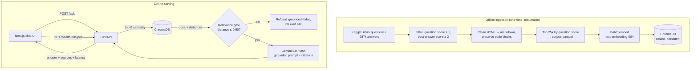

# Architecture

## System overview



## Request flow (`POST /ask`)

1. **Validation** — Pydantic enforces 3–2000 chars, correct type (`422` otherwise).
2. **Retrieval** — embed the question (text-embedding-004), top-5 cosine search in Chroma.
3. **Relevance gate** — hits with cosine distance > `MAX_RELEVANCE_DISTANCE` (0.60) are
   discarded. If none survive, return an honest refusal with `grounded: false` —
   **no LLM call is made**, so out-of-scope questions are fast and cannot hallucinate.
4. **Generation** — surviving docs are formatted as numbered context blocks; the system
   prompt instructs Gemini 2.0 Flash to answer *only* from the context and cite `[n]`.
5. **Response** — answer, source metadata (title, SO link, scores, snippet), measured
   latency, model name. Every error path maps to a clean JSON error (`502`/`503`).

## Ingestion pipeline decisions

| Step | Choice | Rationale |
|---|---|---|
| CSV reading | `latin-1`, 50k-row chunks | Dataset is not valid UTF-8; chunking keeps RAM bounded on the 2 GB files |
| Answer pairing | Highest-scored answer per question | Dataset has no accepted-answer flag; community score is the best proxy |
| Document unit | `title + question + best answer` as ONE chunk | Q&A pairs are natural retrieval units; splitting destroys code context |
| HTML cleaning | `<pre><code>` → fenced ```` ```python ```` blocks, `<code>` → backticks | Code is the core signal; it must survive cleaning intact |
| Size caps | question ≤ 3000 chars, answer ≤ 4000 chars | Stays within the embedding model's effective input window |
| Resumability | Stage 1 cached as parquet; stage 2 skips existing Chroma ids | A rate-limit interruption never loses work |

## Failure modes handled

- **No API key / LLM down** → app boots anyway, `/health` reports state, `/ask` → `503`
- **LLM error mid-request** → `502` with exception class, full trace in server logs
- **Out-of-scope or gibberish question** → polite refusal, `grounded: false`, no LLM cost
- **Frontend cannot reach API** → inline error bubble + red health badge, UI stays usable
